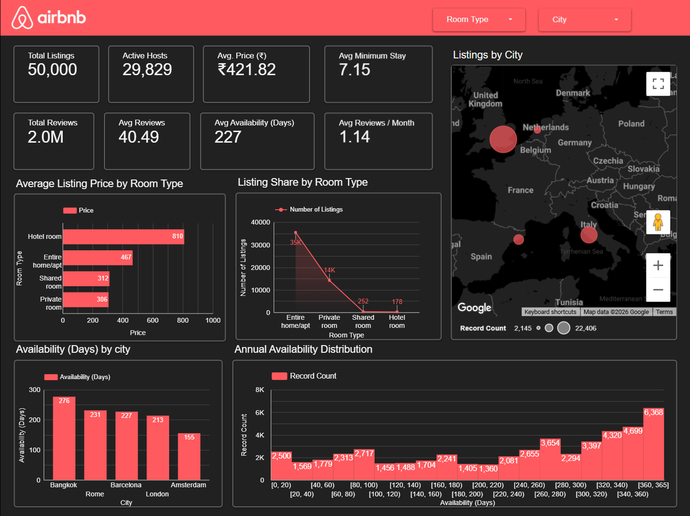
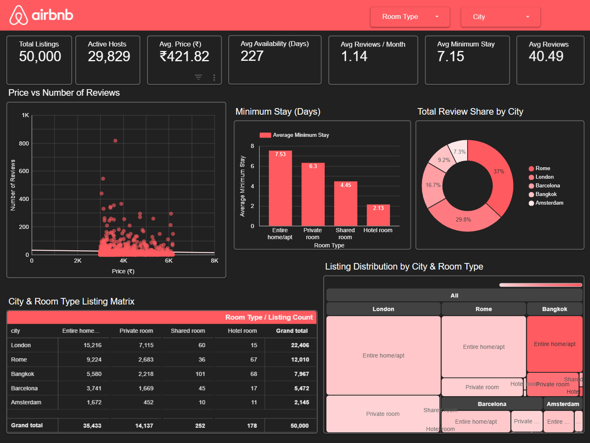

<h1 align="center">Airbnb Data Analytics Dashboard</h1>

<p align="center">
An interactive business intelligence dashboard developed using <b>Google Sheets</b> and <b>Google Looker Studio (formerly Google Data Studio)</b> to analyze Airbnb listing performance, pricing strategies, customer engagement, room type distribution, and property availability across five major cities.
</p>

---

# Project Overview

This project presents an end-to-end **Airbnb Data Analytics Dashboard** developed using a dataset containing **50,000 Airbnb listings**.

The objective of this project is to transform raw Airbnb listing data into meaningful business insights through interactive dashboards. The analysis focuses on listing performance, pricing trends, room type distribution, customer engagement, and annual availability to support data-driven business decision-making.

The dashboard consists of **two analytical pages**:

### Page 1 – Executive Overview

Provides a high-level business summary through KPI cards and interactive visualizations, helping stakeholders quickly understand the overall performance of the Airbnb marketplace.

### Page 2 – Detailed Analytical Insight

Provides deeper analytical insights into customer behavior, pricing patterns, listing distribution, minimum stay requirements, and city-wise performance through advanced visualizations.


---

# File Details

| Attribute | Details |
|------------|---------|
| **Filename** | **[Airbnb_CleanData.csv](https://docs.google.com/spreadsheets/d/164MJ79fPHCDYt3I5QY5TI4j1fPSt8Dhg3D1ko--Rf-o/edit?usp=sharing)** |
| **Google Colab Notebook** | **[Airbnb_Data_Cleaning.ipynb](https://colab.research.google.com/drive/1IpU9saO532VS99zbu2CB4bg3bPT4OXix?usp=sharing)** |
| **Kaggle Notebook** | **[Airbnb Data Cleaning – Swastika Ghosal](https://www.kaggle.com/code/swastikaghosal/airbnb-data-cleaning-swastika-ghosal)** |
| **Total Records** | **50,000** |
| **Primary Keys** | `id`, `host_id`, `city`, `room_type` |
| **Source of Data** | **[airbnb_top_cities.csv](https://www.kaggle.com/datasets/darkmatternet/airbnb-listings-nyc-london-paris-tokyo-and-more)** |
| **Dashboard** | **[Airbnb Analytics Dashboard](https://datastudio.google.com/u/1/reporting/a4868b03-8c2d-41b0-9e78-c85cdaaa0402/page/cks2F/edit)** |

---

# Repository Structure

```text
Airbnb-DataAnalytics-Dashboard
│
├── Dataset
│   └── Airbnb_Clean_Data.csv
│
├── Images
│   ├── CoverPhoto.png
│   ├── Dashboard_Page1.png
│   └── Dashboard_Page2.png
│
└── README.md
```


# Tools & Technologies

- **Kaggle** – Dataset acquisition
- **Google Sheets** – Data validation and preparation
- **Microsoft Excel** – Performed additional exploration and verification
- **Google Colab** – Data cleaning and preprocessing
- **Pandas** – Data manipulation and transformation
- **Google Looker Studio (Google Data Studio)** – Interactive dashboard development and visualization

---

# Data Dictionary

The following table describes the columns available in the cleaned Airbnb dataset used for analysis and dashboard development.

| Column Name | Description | Data Type |
|-------------|-------------|-----------|
| `id` | Unique identifier for each Airbnb listing | Integer |
| `name` | Name or title of the Airbnb listing | Text |
| `host_id` | Unique identifier of the host | Integer |
| `host_name` | Name of the Airbnb host | Text |
| `neighbourhood` | Neighborhood where the listing is located | Text |
| `latitude` | Latitude coordinate of the property | Decimal |
| `longitude` | Longitude coordinate of the property | Decimal |
| `room_type` | Type of accommodation offered | Text |
| `price` | Nightly rental price of the listing | Decimal |
| `minimum_nights` | Minimum number of nights required for booking | Integer |
| `number_of_reviews` | Total number of customer reviews received | Integer |
| `last_review` | Date of the most recent customer review | Date |
| `reviews_per_month` | Average number of reviews received per month | Decimal |
| `calculated_host_listings_count` | Number of active listings owned by the host | Integer |
| `availability_365` | Number of days the listing is available in a year | Integer |
| `number_of_reviews_ltm` | Number of reviews received during the last 12 months | Integer |
| `license` | Registration or license information of the listing | Text |
| `city` | City where the Airbnb listing is located | Text |
| `scrape_date` | Date on which the dataset was collected | Date |


---


# Data Cleaning Notes

The following table summarizes the data cleaning and preprocessing activities performed on the Airbnb dataset before dashboard development.

| Column Name | Activities |
|-------------|------------|
| `neighbourhood_group` | Removed the column because it contained only missing values and did not contribute to the analysis. |
| `host_name` | Replaced missing values with **"Unknown"** to preserve valid listing records. |
| `last_review` | Converted the column to **DateTime** format. Missing values were intentionally retained because they represent listings without customer reviews. |
| `scrape_date` | Converted the column to **DateTime** format for proper date-based analysis. |
| `reviews_per_month` | Verified that missing values corresponded to listings with zero reviews and replaced them with **0**. |
| `price` | Removed records containing missing values. Performed statistical analysis to identify outliers and retained listings with prices less than or equal to **6188**. |
| `license` | Replaced missing values with **"Not Available"**. |

---


# Executive Overview Dashboard

The Executive Overview dashboard provides a high-level summary of Airbnb listing performance across five major cities. It enables stakeholders to monitor key business metrics, compare pricing strategies, evaluate listing distribution, analyze property availability, and identify geographical trends through interactive visualizations.

## Dashboard Preview



---

## A. Key Insights

### 1. KPI Summary

- The dataset contains **50,000 Airbnb listings** managed by **29,829 active hosts**.
- The average listing price across all cities is **₹421.82**.
- The average minimum stay requirement is **7.15 nights**.
- The listings have accumulated approximately **2 million customer reviews**, indicating strong customer engagement.
- On average, each listing receives **40.49 reviews**, with **1.14 reviews per month**.
- Properties remain available for an average of **227 days per year**, indicating moderate annual occupancy.

---

### 2. Average Listing Price by Room Type

- **Hotel rooms** have the highest average listing price (₹810).
- **Entire homes/apartments** are the second most expensive accommodation type.
- **Private rooms** and **Shared rooms** are comparatively more affordable, making them attractive to budget-conscious travelers.

---

### 3. Listing Share by Room Type

- **Entire homes/apartments** dominate the marketplace with approximately **35,000 listings**.
- **Private rooms** represent the second-largest accommodation category.
- **Shared rooms** and **Hotel rooms** account for only a small fraction of total listings.

---

### 4. Listings by City (Geo Map)

- Listing availability varies significantly across cities.
- Some metropolitan cities have a much larger concentration of Airbnb properties, indicating stronger market penetration.
- The geographical visualization clearly highlights regional differences in listing density.

---

### 5. Average Availability (Days) by City

- **Bangkok** has the highest average annual availability (**276 days**).
- **Rome** and **Barcelona** show similar availability levels.
- **London** has slightly lower availability.
- **Amsterdam** has the lowest average availability, suggesting comparatively higher occupancy.

---

### 6. Annual Availability Distribution

- Property availability is distributed across the entire year.
- A large number of listings remain available for **340–365 days**, indicating many properties operate almost year-round.
- Moderate availability ranges also contain a substantial number of listings, reflecting diverse host availability strategies.

---

## B. Analytical Recommendations

### KPI Summary

- Monitor average pricing and occupancy trends regularly to identify market shifts.
- Improve host engagement initiatives to increase customer reviews and listing activity.
- Track average availability to better understand seasonal demand patterns.

---

### Average Listing Price by Room Type

- Premium hotel rooms should continue targeting high-value travelers.
- Private and shared rooms can be promoted to budget travelers through pricing campaigns.
- Dynamic pricing strategies can help maximize revenue across different accommodation types.

---

### Listing Share by Room Type

- Encourage growth in underrepresented accommodation categories such as hotel rooms and shared rooms.
- Expand the supply of high-demand property types while maintaining a balanced marketplace.
- Analyze customer demand before increasing inventory in less popular room categories.

---

### Listings by City

- Prioritize marketing investments in cities with high listing concentrations.
- Develop targeted growth strategies for cities with lower Airbnb market penetration.
- Use geographic performance monitoring to optimize regional business decisions.

---

### Average Availability (Days) by City

- Investigate why Bangkok listings remain available longer and whether occupancy can be improved.
- Study Amsterdam's comparatively lower availability to identify successful booking patterns.
- Adjust promotional campaigns according to city-specific occupancy behavior.

---

### Annual Availability Distribution

- Encourage hosts with extremely high availability to optimize pricing during low-demand periods.
- Identify seasonal booking opportunities to reduce prolonged vacancies.
- Develop occupancy-focused promotional campaigns for listings with consistently high availability.


---

# Detailed Analytical Insights Dashboard

The Detailed Analytical Insights dashboard explores relationships between pricing, customer reviews, minimum stay requirements, room type preferences, and city-wise listing distribution. It helps stakeholders identify booking patterns, optimize pricing strategies, evaluate market demand, and make data-driven business decisions.

## Dashboard Preview



---

## A. Key Insights

### 1. Price vs Number of Reviews

- No strong positive relationship is observed between listing price and the number of customer reviews.
- Many moderately priced listings receive significantly more reviews than premium-priced properties.
- Several high-priced listings have relatively low customer engagement, indicating that higher pricing does not necessarily translate into greater popularity.

---

### 2. Average Minimum Stay by Room Type

- **Entire homes/apartments** require the longest average minimum stay (**7.53 days**).
- **Private rooms** require an average minimum stay of **6.3 days**.
- **Shared rooms** have a comparatively lower minimum stay requirement (**4.45 days**).
- **Hotel rooms** offer the highest booking flexibility with the lowest average minimum stay (**2.13 days**).

---

### 3. Total Review Share by City

- **Rome** contributes the largest share of customer reviews (**37%**).
- **London** accounts for approximately **29.8%** of total reviews.
- **Barcelona** contributes around **16.7%**.
- **Bangkok** and **Amsterdam** account for smaller proportions of the overall review volume.

---

### 4. City & Room Type Listing Matrix

- **Entire homes/apartments** represent the largest accommodation category across all cities.
- **London** has the highest number of listings among the analyzed cities.
- **Private rooms** form the second-largest accommodation category.
- **Shared rooms** and **Hotel rooms** contribute only a small percentage of the total inventory.

---

### 5. Listing Distribution by City & Room Type

- Entire homes/apartments dominate the Airbnb marketplace across all five cities.
- London and Rome contribute the largest listing volumes.
- Bangkok also maintains a significant market presence.
- Barcelona and Amsterdam have comparatively smaller Airbnb inventories.
- Hotel rooms remain the least represented accommodation type across every city.

---

## B. Analytical Recommendations

### Price vs Number of Reviews

- Focus on improving listing quality and customer experience rather than increasing prices alone.
- Encourage hosts to improve ratings and review generation through better guest engagement.
- Implement dynamic pricing strategies to maximize occupancy without reducing competitiveness.

---

### Average Minimum Stay by Room Type

- Consider reducing minimum stay requirements for entire homes during low-demand periods to increase occupancy.
- Maintain flexible booking options for hotel rooms to attract short-term travelers.
- Evaluate seasonal minimum stay policies to balance occupancy and operational efficiency.

---

### Total Review Share by City

- Study Rome's performance to identify factors contributing to stronger customer engagement.
- Strengthen promotional campaigns in cities with comparatively lower review shares.
- Encourage hosts in lower-performing markets to improve guest experience and review collection.

---

### City & Room Type Listing Matrix

- Expand inventory in cities with strong demand while maintaining a balanced room-type distribution.
- Promote underrepresented accommodation types where market opportunities exist.
- Monitor listing growth to prevent oversupply within specific room categories.

---

### Listing Distribution by City & Room Type

- Prioritize marketing and investment in cities demonstrating high marketplace activity.
- Encourage diversification of accommodation types to provide travelers with greater choice.
- Use city-level inventory analysis to support strategic expansion and resource allocation.

---


# Focus Outcomes

## Dashboard 1 – Executive Overview Dashboard

The primary focus of the Executive Overview Dashboard is to provide stakeholders with a high-level understanding of the Airbnb marketplace through key performance indicators and summary visualizations. The dashboard focuses on:

- Presenting key business metrics, including Total Listings, Active Hosts, Average Price, Average Reviews, Average Availability, and Minimum Stay.
- Comparing average listing prices across different room types to understand pricing strategies.
- Analyzing the distribution of Airbnb listings by room type to identify the most preferred accommodation category.
- Visualizing the geographical distribution of listings across five major cities using an interactive map.
- Comparing average annual availability across cities to evaluate listing accessibility and occupancy potential.
- Examining the annual availability distribution to understand how frequently properties remain available throughout the year.
- Providing an executive-level overview that enables quick business assessment and supports strategic decision-making.

## Dashboard 2 – Detailed Analytical Insights Dashboard

The Detailed Analytical Insights Dashboard focuses on exploring relationships within the Airbnb dataset through comparative and analytical visualizations. The dashboard focuses on:

- Investigating the relationship between listing prices and customer reviews to identify pricing and engagement patterns.
- Comparing average minimum stay requirements across different room types.
- Analyzing the contribution of each city to the overall review volume through city-wise review share.
- Examining listing distribution across cities and room types using matrix and treemap visualizations.
- Identifying dominant room types within each city to understand accommodation preferences.
- Supporting detailed market comparison by enabling stakeholders to evaluate city-level and room type-level performance.
- Facilitating deeper business analysis that complements the executive insights provided in Dashboard 1.

---


# Business Conclusions

Based on the analysis of **50,000 Airbnb listings** across five major cities, several meaningful business insights were identified regarding pricing strategies, customer engagement, accommodation preferences, and property availability.

- **Entire homes/apartments** dominate the Airbnb marketplace, representing the largest share of listings across all analyzed cities.

- **Hotel rooms** command the highest average nightly price, while **Private rooms** and **Shared rooms** provide more affordable accommodation options for budget-conscious travelers.

- Customer reviews are **not strongly correlated with listing price**, indicating that guest satisfaction and listing quality play a more significant role than premium pricing in attracting reviews.

- **Rome** and **London** demonstrate the highest levels of customer engagement, contributing the largest share of total reviews among the analyzed cities.

- **Bangkok** exhibits the highest average annual availability, whereas **Amsterdam** shows comparatively lower availability, suggesting stronger occupancy rates.

- Minimum stay requirements vary considerably across room types, with **Entire homes/apartments** requiring the longest average stays and **Hotel rooms** offering the greatest booking flexibility.

- The dashboard enables stakeholders to identify market trends, compare city-level performance, evaluate room type distribution, and support data-driven pricing and inventory decisions.

Overall, this project demonstrates how data cleaning, preprocessing, and interactive business intelligence dashboards can transform raw Airbnb listing data into actionable insights that support strategic decision-making for hosts, property managers, and business stakeholders.

---
